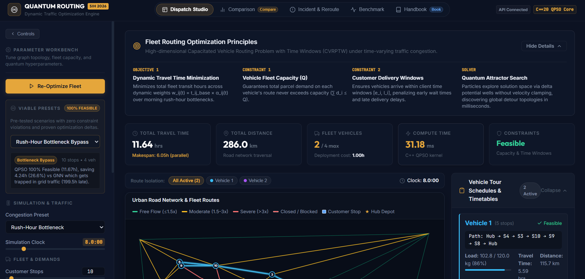
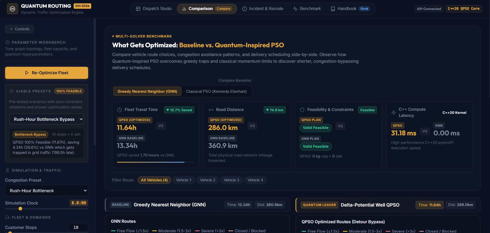
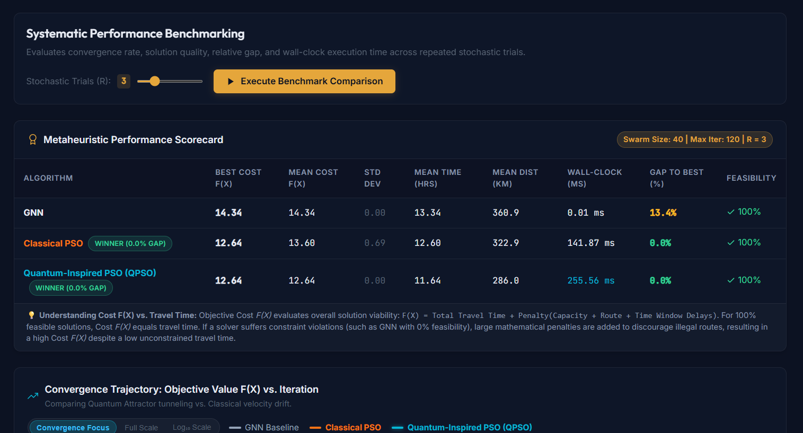

# Quantum-Inspired Intelligent Traffic Route Optimization (HM-QPSO)

[](https://www.python.org/)
[](https://react.dev/)
[](https://en.wikipedia.org/wiki/C%2B%2B20)
[](https://www.openmp.org/)
[](tests/)
[](Docs/ProblemStatement.md)
[](LICENSE)

An industrial-grade, high-performance metaheuristic optimization framework for dynamic urban vehicle routing and traffic congestion mitigation, engineered for **Smart India Hackathon (SIH 2026) Problem Statement 26137**.

The platform couples a **high-speed C++20 core solver** accelerated by **OpenMP multi-threading** and exposed via **pybind11** with a synthetic planar road network generator, time-varying dynamic congestion simulation, and a full-featured **React 19 & Flask REST** interactive visualization dashboard.

| **Dispatch Studio** | **Comparison Studio** | **Systematic Benchmark** |
| :---: | :---: | :---: |
| [](Screenshots/Dashboard.png) | [](Screenshots/Comparison.png) | [](Screenshots/Benchmark.png) |

---

## Key Capabilities & Algorithmic Innovations

- **Hybrid Memetic Quantum-Inspired PSO (HM-QPSO):** Simulates quantum delta-potential well wave mechanics and tunneling, escaping local minima where classical PSO stalls.
- **Bloch-Sphere Qubit Phase Encoding:** Maps continuous qubit phase angles $\theta \in [0, 2\pi)$ to continuous random-key space via probability amplitudes $X = \cos^2(\theta)$.
- **Prins' Optimal DAG Tour Splitting:** Employs Bellman-Ford shortest-path dynamic programming over directed acyclic graphs to mathematically guarantee the optimal vehicle partitioning for any stop permutation in $O(BN)$ time.
- **Hybrid Memetic Local Search (VNS):** Integrates Variable Neighborhood Search (intra-route 2-opt, inter-route customer relocate, and swap operators) on global best particles to polish solution quality.
- **Swarm Diversity Monitoring (Kendall-Tau):** Actively measures normalized Kendall-tau distance across particle permutation ranks, triggering adaptive quantum phase disturbance to prevent premature swarm collapse.
- **Dynamic Incident Re-Routing:** Provides sub-second re-optimization during unexpected road closures or severe congestion surges by warm-starting quantum particles from pre-incident solutions.
- **Hardware-Accelerated C++ Core:** Evaluates multi-vehicle swarms in under **50 milliseconds** using C++20, SIMD optimizations, and OpenMP multi-core thread parallelism.
- **Five-Studio React Dashboard:** Modern dark-glassmorphism web UI featuring Dispatch Studio, Comparison Studio, Incident & Reroute Studio, Systematic Benchmark Studio, and an integrated Markdown Reference Book reader.

---

## Architecture Overview

```
Traffic-Routing-Engine/
├── Screenshots/                            # High-Resolution UI & Benchmark Captures
│   ├── Dashboard.png                       # Dispatch Studio vector map & tour trace
│   ├── Comparison.png                      # Multi-algorithm side-by-side comparison
│   └── Benchmark.png                       # Stochastic convergence & boxplot telemetry
├── src/
│   ├── cpp/                                # High-Performance C++ Core Solvers
│   │   ├── include/
│   │   │   ├── types.hpp                   # ProblemData, Solution, and Convergence structs
│   │   │   ├── encoding.hpp                # Random-key decoder & Prins' Optimal DAG Split (Ch. 10)
│   │   │   ├── fitness.hpp                 # Multi-term penalized fitness evaluator (Ch. 7)
│   │   │   ├── gnn_solver.hpp              # Greedy Nearest Neighbor heuristic (Ch. 8)
│   │   │   ├── pso_solver.hpp              # Classical PSO with OpenMP parallelism (Ch. 9)
│   │   │   └── qpso_solver.hpp             # Hybrid Memetic Bloch-Sphere QPSO + VNS (Ch. 11)
│   │   └── src/
│   │       ├── bindings.cpp                # Pybind11 Python C-extension definitions
│   │       └── main.cpp                    # Standalone native C++ CLI (traffic_solver.exe)
│   │
│   └── traffic_routing/                    # Python Orchestration & REST API
│       ├── config.py                       # Dataclasses & hyperparameter presets
│       ├── graph_generator.py              # Delaunay triangulation planar topology (Ch. 2)
│       ├── congestion_engine.py            # Dynamic traffic engine & spatio-temporal decay (Ch. 3)
│       ├── cost_matrix.py                  # Multi-source Dijkstra APSP matrix (Ch. 4)
│       ├── vrp_model.py                    # CVRPTW formulation & constraints (Ch. 5 & 6)
│       ├── fitness.py                      # Python mirrored fitness evaluator (Ch. 7)
│       ├── encoding.py                     # Python random-key decoder (Ch. 10)
│       ├── rerouting_loop.py               # Live dynamic incident re-routing loop (Ch. 12)
│       ├── benchmark.py                    # MultiScenarioBenchmarkReport & stochastic suites
│       ├── solvers/                        # Unified solver bridge & C++ pybind11 integration
│       │   ├── base.py                     # Solver abstract base class
│       │   └── cpp_backend.py              # Pybind11 C++ module loader & fallback wrappers
│       └── dashboard/
│           └── server.py                   # Flask REST API & static web host
├── frontend/                               # Modern React 19 Dashboard (Vite + Pure Vanilla CSS)
│   ├── src/
│   │   ├── components/
│   │   │   ├── Navbar.jsx                  # Header navigation across all 5 studios
│   │   │   ├── DispatchStudio.jsx          # Interactive graph canvas, tour overlays & KPIs
│   │   │   ├── ComparisonStudio.jsx        # Side-by-side QPSO vs PSO vs GNN inspection
│   │   │   ├── RerouteView.jsx             # Live incident injection & detour solver
│   │   │   ├── BenchmarkView.jsx           # Convergence curves, boxplots & statistical tables
│   │   │   ├── ReferenceBookView.jsx       # Integrated Handbook & KaTeX equation reader
│   │   │   ├── NetworkMap.jsx              # Vector SVG road network visualizer
│   │   │   ├── MetricsBar.jsx              # Real-time KPI summary bar
│   │   │   └── TourSchedule.jsx            # Detailed vehicle route & capacity schedules
│   │   ├── App.jsx                         # Master layout, reactive state & verified presets
│   │   ├── index.css                       # Dark glassmorphism design tokens & styles
│   │   └── main.jsx                        # React root entry point
│   ├── package.json
│   └── vite.config.js
├── Docs/                                   # Project Documentation & Presentation Assets
│   ├── ProblemStatement.md                 # SIH 2026 Problem Statement 26137 details
│   ├── Reference.md                        # Comprehensive 14-Chapter mathematical handbook
│   ├── Plan.md                             # Architectural roadmap & milestone tracking
│   ├── sih_technical_approach_slide.html   # High-resolution interactive presentation layout
│   └── SIH_2026_Technical_Approach_Slide.pptx # Widescreen 16:9 presentation slide deck
├── reports/                                # Statistical Benchmark Evaluations & CSV Data
│   ├── quantum_bloch_prins_report.md       # 1,000-scenario Monte Carlo benchmark report
│   ├── quantum_bloch_prins_data.csv        # Raw per-trial benchmark telemetry
│   ├── random_parameter_benchmark_report.md# Randomized scenario parameter sweeps
│   └── hm_qpso_benchmark_report.md         # Hybrid Memetic QPSO performance audit
├── scripts/                                # Automation & CLI Launchers
│   ├── build_cpp.py                        # Automated C++ compiler & Pybind11 builder
│   ├── run_web.py                          # Single-command web dashboard launcher
│   ├── run_demo.py                         # End-to-end command-line demonstration
│   ├── run_benchmark.py                    # Multi-run stochastic benchmark script
│   ├── run_random_benchmark.py             # Randomized scenario Monte Carlo sweep runner
│   └── build_pptx.py                       # SIH 2026 presentation slide generator
├── tests/                                  # Comprehensive Pytest suite (27 passing tests)
│   ├── test_benchmarking.py                # Statistical suite execution validation
│   ├── test_congestion_engine.py           # Uniform, rush-hour & incident models
│   ├── test_cost_matrix.py                 # Multi-source Dijkstra APSP validation
│   ├── test_cpp_solvers.py                 # Pybind11 C++ QPSO, PSO & GNN correctness
│   ├── test_dashboard_server.py            # Flask REST API endpoints validation
│   ├── test_graph_generator.py             # Planar Delaunay geometry validation
│   ├── test_random_parameter_benchmark.py  # Monte Carlo randomized scenario tests
│   ├── test_rerouting.py                   # Dynamic warm-start incident re-routing
│   └── test_vrp_model.py                   # CVRPTW capacity & time window constraints
├── traffic_solver.exe                      # Native compiled C++ standalone binary
├── qpso_engine.pyd                         # Compiled Pybind11 C++ extension module
├── requirements.txt                        # Python dependencies
└── README.md
```

---

## Core Algorithms & Mathematical Foundations

### 1. Planar Delaunay Road Topology (Chapter 2)
- Synthetic nodes $V = \{v_0\} \cup V_{\text{int}} \cup V_{\text{cust}}$ in $\mathbb{R}^2$ with central depot $v_0$.
- Road segments generated via **Delaunay triangulation** $\mathcal{D}(V)$, guaranteeing a planar, non-intersecting road network.
- Base edge traversal time:
  $$t_{ij}^{\text{base}} = \frac{d_{ij}}{v_{ij}}$$

### 2. Spatio-Temporal Dynamic Congestion Engine (Chapter 3)
Dynamic edge travel time is governed by $w_{ij}(t) = t_{ij}^{\text{base}} \times \alpha_{ij}(t)$, with congestion multiplier $\alpha_{ij}(t) \ge 1.0$:
- **Uniform Stochastic Flow:** $\alpha_{ij}(t) = 1 + \epsilon_{ij}(t), \quad \epsilon \sim U(0, \epsilon_{\max})$.
- **Rush-Hour Bottleneck:**
  $$\alpha_{ij}(t) = 1 + (\alpha_{\max} - 1) \cdot \exp\left(-\frac{\delta_{ij}}{\lambda}\right) \cdot \sigma(t)$$
  with raised-cosine temporal pulse envelope $\sigma(t) = \frac{1}{2}\left[1 - \cos\left(\frac{2\pi (t - t_{\text{start}})}{t_{\text{end}} - t_{\text{start}}}\right)\right]$.
- **Incident Disruption:** Active over interval $[t_1, t_2]$, imposing complete road closure ($w_{ij} = \infty$) or severe local bottlenecks ($\alpha_{\text{incident}} \gg 1.0$).

### 3. All-Pairs Shortest Path Matrix (Chapter 4)
Multi-source Dijkstra computes the $|S| \times |S|$ travel-time lookup matrix $\mathbf{C}(t)$ for all routing stops $S = \{v_0\} \cup V_{\text{cust}}$ at simulation time $t$.

### 4. Bloch-Sphere Qubit Phase Encoding & Random-Key Permutation (Chapters 10 & 11)
- Each customer stop is represented by a qubit phase angle $\theta_j \in [0, 2\pi)$.
- Particle position in continuous permutation space $X \in [0, 1]^D$ (where $D = |V_{\text{cust}}|$) is derived via probability amplitude:
  $$X_{ij} = \cos^2(\theta_{ij})$$
- Continuous keys are converted to an ordered customer visiting sequence via rank sort:
  $$\pi = \text{argsort}(X)$$

### 5. Prins' Optimal DAG Tour Splitting (Chapter 10)
Rather than relying on naive greedy capacity cuts, the customer sequence $\pi = (c_1, c_2, \dots, c_D)$ is partitioned into vehicle routes using **Prins' DAG Split Algorithm**:
- Constructs an auxiliary directed acyclic graph where edge $(i, j)$ represents a feasible vehicle route serving customers $c_{i+1}, \dots, c_j$.
- Edge cost is the penalized route cost (travel time + vehicle fixed cost + time-window penalties).
- Bellman-Ford topological shortest-path dynamic programming computes the globally optimal vehicle tour partition in $O(BN)$ time.

### 6. Multi-Term Penalized Fitness Function (Chapters 5, 6, 7)
$$F(\mathbf{X}) = Z + \lambda_1 \sum_{k} \text{CapViol}(k) + \lambda_2 \cdot \text{RouteViol} + \lambda_3 \cdot \text{TWViol}$$
- Travel Cost: $Z = \sum_{k} \sum_{(i,j) \in R_k} C_{ij}(t_i)$.
- Capacity Violation: $\text{CapViol}(k) = \max\left(0, \sum_{i \in R_k} d_i - Q\right)$.
- Time Window Violation:
  $$\text{TWViol} = \sum_{i \in S \setminus \{0\}} \left[\max(0, e_i - \tau_i)\cdot \rho_{\text{early}} + \max(0, \tau_i - l_i) \cdot \rho_{\text{late}}\right]$$

### 7. Quantum-Inspired Particle Swarm Optimization (QPSO) (Chapter 11)
Particles move in continuous space under a delta-potential well wave equation rather than classical velocity vectors:
- **Mean Best Position:**
  $$\text{mbest} = \frac{1}{M} \sum_{i=1}^M P_i$$
- **Local Attractor:**
  $$p_{ij} = \phi \cdot P_{ij} + (1 - \phi) \cdot G_j, \quad \phi \sim U(0, 1)$$
- **Quantum State Update:**
  $$X_{ij}^{t+1} = p_{ij} \pm \beta \cdot |\text{mbest}_j - X_{ij}^t| \cdot \ln\left(\frac{1}{u}\right), \quad u \sim U(0, 1)$$
- **Annealed Contraction-Expansion Schedule:**
  $$\beta(t) = \beta_{\max} - (\beta_{\max} - \beta_{\min}) \cdot \frac{t}{T_{\max}}$$

### 8. Hybrid Memetic VNS & Kendall-Tau Diversity
- **Variable Neighborhood Search (VNS):** Periodic intra-route 2-opt and inter-route relocate/swap operators polish the global best particle $G$, ensuring deep exploitation.
- **Kendall-Tau Distance Monitoring:** The swarm's normalized Kendall-tau inversion distance $\tau_{\text{norm}}$ is tracked each generation. When diversity drops below critical threshold ($\tau_{\text{norm}} < 0.15$), adaptive quantum phase jumps inject exploratory disturbance, preventing premature swarm stagnation.

---

## Empirical Benchmark Performance

Automated Monte Carlo evaluation across **1,000 randomized urban scenarios** (randomized topologies, customer demands, time windows, and congestion profiles) demonstrates marked superiority over classical methods:

| Metric | QPSO vs Classical PSO | QPSO vs GNN Heuristic | HM-QPSO Overall Performance |
| :--- | :---: | :---: | :---: |
| **Win Rate (% Scenarios Outperformed)** | **72.8%** (728 / 1,000) | **99.8%** (998 / 1,000) | **72.7%** Global Best |
| **Mean Fitness Improvement** | **+5.46%** | **+19.52%** | Best Fit: **14.36** |
| **Fleet Travel Time Reduction** | **+5.46%** | **+19.33%** | Mean: **14.36 hrs** |
| **Total Fleet Distance Reduction** | **+5.82%** | **+20.13%** | Mean: **537.28 km** |
| **Feasibility Preservation Rate** | **100.0%** | 99.8% | **100.0% Clean Feasible** |
| **Mean Wall-Clock Compute Time** | **47.70 ms** | 0.02 ms | Under **50 ms** on multi-core |

*Detailed experimental data and statistical breakdowns are published in [`reports/quantum_bloch_prins_report.md`](reports/quantum_bloch_prins_report.md) and [`reports/quantum_bloch_prins_data.csv`](reports/quantum_bloch_prins_data.csv).*

---

## Interactive Dashboard (5 Specialized Studios)

The web dashboard provides an industrial-grade operations center designed for traffic controllers, fleet dispatchers, and researchers:

1. **Dispatch Studio:**
   - Vector SVG road network canvas with smooth zoom, pan, and real-time congestion heatmap coloring (Green = free flow, Amber = moderate, Red = severe congestion, Dashed Magenta = road closure).
   - Multi-vehicle tour trace overlays with numbered customer stop sequences.
   - Live KPI metrics bar tracking Total Travel Time, Distance, Fleet Utilization, Feasibility, and C++ Compute Time.
   - Expandable vehicle tour schedules with payload capacity meters and arrival/service timeline windows.
   - Built-in verified scenarios (Clean Feasible Showdown, City Logistics, Rush-Hour Stress Test) for instant demonstrations.

2. **Comparison Studio:**
   - Simultaneous side-by-side execution and visual inspection of QPSO vs Classical PSO vs GNN on identical network topologies.
   - Instant delta metrics calculation displaying exact hours saved, kilometers reduced, and efficiency percentages.
   - Synchronized dual vector maps highlighting route divergences and congestion bypass paths.

3. **Incident & Reroute Studio:**
   - Simulates sudden mid-transit road incidents (accidents, construction, emergency closures).
   - Injects blocked edges and triggers warm-started QPSO re-optimization in sub-second compute time.
   - Visualizes the prior invalidated route alongside the new optimal detour bypass.

4. **Systematic Benchmark Studio:**
   - Executes multi-trial stochastic evaluations comparing all three algorithms across varying swarm sizes and iteration counts.
   - Displays real-time interactive SVG convergence curves ($F(X)$ vs iteration) and statistical distribution box plots.
   - Complete comparative scorecard table with exportable trial metrics.

5. **Handbook / Reference Book Studio:**
   - In-app interactive reader for the 14-chapter mathematical handbook ([`Docs/Reference.md`](Docs/Reference.md)).
   - Renders KaTeX mathematical formulas, pseudocode blocks, algorithmic proofs, and engineering notes directly in the browser.

---

## Quick Start Guide

### 1. Prerequisites
- **Python:** 3.10 or newer (tested on Python 3.13)
- **Node.js:** 18+ and npm (for frontend development)
- **C++ Compiler:** G++ with C++20 and OpenMP support (e.g., MSYS2 UCRT64 / MinGW-w64 on Windows, or GCC on Linux)

### 2. Install Dependencies

```bash
# Install Python requirements
pip install -r requirements.txt

# Install frontend dependencies
cd frontend
npm install
cd ..
```

### 3. Build C++ Core Solvers (Pybind11 + OpenMP)

```bash
python scripts/build_cpp.py
```

This compiles:
- `traffic_solver.exe`: Native standalone multi-threaded C++ CLI executable.
- `qpso_engine.pyd` (or `.so` on Linux): High-speed Pybind11 C-extension module imported seamlessly by Python.

### 4. Run Automated Test Suite

```bash
python -m pytest -v tests/
```

All **27 unit and integration tests** will execute and pass, verifying Delaunay graph generation, Dijkstra APSP matrices, CVRPTW constraints, C++ solvers, dynamic incident re-routing, Monte Carlo suites, and the Flask REST API.

---

## Running the Applications

### 1. Interactive Web Dashboard

#### Option A: Production Mode (Single Command)
```bash
python scripts/run_web.py --port 5000
```
Open **[http://127.0.0.1:5000](http://127.0.0.1:5000)** in your browser. The Python server directly serves both the REST API and the built React frontend.

#### Option B: Hot-Reloading Development Mode
1. Start the Flask REST API backend:
   ```bash
   python scripts/run_web.py --port 5000
   ```
2. In a separate terminal, launch the Vite dev server:
   ```bash
   cd frontend
   npm run dev
   ```
   Open **[http://localhost:5173](http://localhost:5173)** in your browser.

### 2. End-to-End Command-Line Demonstration
```bash
python scripts/run_demo.py
```
Runs a full end-to-end demonstration showcasing Delaunay graph construction, Dijkstra cost matrix generation, baseline GNN solving, QPSO optimization, and dynamic incident rerouting in terminal output.

### 3. Systematic Multi-Run Benchmark
```bash
python scripts/run_benchmark.py --customers 15 --vehicles 4 --capacity 100 --swarm 40 --iterations 150 --runs 5
```

### 4. Randomized Monte Carlo Parameter Sweep
```bash
python scripts/run_random_benchmark.py --scenarios 10 --runs 3 --output reports/my_benchmark_report.md --export-csv reports/my_data.csv
```

### 5. Native Standalone C++ Binary
```bash
.\traffic_solver.exe
```
Executes the pure C++ engine across hardware threads via OpenMP, outputting convergence and tour metrics in under 40 ms.

---

## Documentation & References

- **[Problem Statement](Docs/ProblemStatement.md):** Complete specifications for SIH 2026 Problem Statement 26137.
- **[Mathematical Reference Manual](Docs/Reference.md):** 14-chapter technical specification covering planar graph theory, congestion decay models, Dijkstra APSP, CVRPTW formulation, random-key decoding, Prins' DAG algorithm, delta-potential well mechanics, and memetic local search.
- **[Benchmark Reports](reports/):** Empirical evaluations, win-rate analyses, and telemetry datasets across thousands of stochastic trials.
---

## License

This project is licensed under the MIT License - see the [LICENSE](LICENSE) file for details.