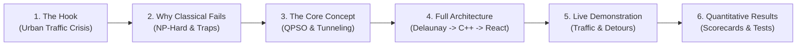

Viewed ProblemStatement.md:1-43
Viewed Reference.md:1-786
Viewed Plan.md:1-164
Listed directory Traffic-Routing-Engine
Viewed README.md:1-179
Listed directory traffic_routing
Listed directory include
Listed directory src
Listed directory components
Listed directory tests
Viewed config.py:1-88

Here is a complete, structured **Technical Approach** guide designed for you to explain this entire project from first principles to anyone—whether they are technical evaluators, hackathon judges (such as for SIH), senior software engineers, or academic reviewers—even if they know nothing about the problem statement or your solution.

---

# 1. Executive Summary & Narrative Hook (The 2-Minute Pitch)

> **How to start:**
> *"Imagine an urban logistics fleet of delivery vehicles operating in a major city during morning rush hour. Traffic isn't static—it surges, bottlenecks, and roads abruptly close due to accidents. Calculating the optimal set of routes that minimizes fleet travel time while satisfying delivery time windows and vehicle cargo capacities is an NP-hard problem. If you try to calculate all combinations for just 20 stops, there are more possible routes than grains of sand on Earth.*
>
> *Classical algorithms either get stuck in suboptimal traffic jams (premature convergence in local minima) or take too long to compute. While true quantum computers promise exponential speedups, current quantum hardware is too noisy and small-scale to solve city-wide logistics today.*
>
> *To solve this, we built a **Quantum-Inspired Intelligent Traffic Routing Engine**. We formulated the full Capacitated Vehicle Routing Problem with Time Windows (CVRPTW) on a dynamic road network, and developed a **Quantum-Inspired Particle Swarm Optimization (QPSO)** algorithm that simulates quantum wavefunctions and tunneling on classical hardware. We backed it with a **multi-threaded C++20 core (OpenMP)** running in tens of milliseconds, a **Python orchestration layer**, and a **React 19 interactive dark-glassmorphism dashboard** featuring live incident re-routing, vector maps, and real-time comparative benchmarking."*

---

# 2. The Core Problem & Why Classical Solvers Fail

### The Combinatorial Nightmare: CVRPTW
The problem is the **Capacitated Vehicle Routing Problem with Time Windows (CVRPTW)**:
* A fleet of $m$ vehicles with capacity $Q$ starts at a central depot.
* They must service $n$ customers, each having a parcel demand $d_i$, a service time $s_i$, and an allowed delivery time window $[e_i, l_i]$.
* Every vehicle must return to the depot without exceeding its capacity or missing customer deadlines.
* The search space scales factorially ($O(n!)$). For 30 delivery stops, brute-force search is physically impossible.

### The Real-World Friction: Dynamic Spatio-Temporal Congestion
Unlike textbook problems where edge distances are constant, real-world roads fluctuate over time:
* **Rush-Hour Waves:** Congestion builds up around high-traffic intersections and cascades outward into residential roads, then dissipates smoothly.
* **Sudden Incidents:** An accident or construction at 8:15 AM can turn a major arterial road into a parking lot or completely close it.
* Static routes planned in the morning become obsolete within minutes.

### The Algorithmic Dilemma: Classical vs. Quantum vs. Quantum-Inspired
1. **Exact Solvers (Integer Linear Programming / Branch-and-Cut):** Guarantee mathematical optimality, but their runtime blows up exponentially. They cannot make real-time decisions when a road closes.
2. **Greedy Heuristics (Nearest Neighbor):** Very fast ($O(n^2)$), but extremely myopic. They pick the closest stop first, leaving distant stops for the end, leading to huge detours and high travel times.
3. **Classical Metaheuristics (Classical PSO / Genetic Algorithms):** They maintain a population (particles) exploring the search space using velocity vectors. **Their fatal flaw is premature convergence:** when particles gather around a local minimum, their velocities shrink to zero. Once trapped, classical particles have zero probability of jumping over high cost barriers.
4. **Pure Quantum Computers (NISQ era):** Quantum Annealers (D-Wave) and Gate-Based QPUs (IBM/Google) offer theoretical advantages, but suffer from qubit count limits, decoherence, and extreme noise. You cannot plug a city's road network into quantum hardware today.
5. **The Solution: Quantum-Inspired Metaheuristics (QPSO):** We borrow the physics of quantum mechanics—specifically the **Schrödinger wave equation** and a **delta-potential well**—and implement them as classical numerical algorithms. This replaces Newtonian velocities with quantum probability clouds, giving particles an infinite search horizon and the mathematical ability to "tunnel" out of local traps.

---

# 3. High-Level System Architecture

The project is structured into clean, decoupled engineering layers:

```
┌─────────────────────────────────────────────────────────────────────────┐
│                      1. ROAD NETWORK & CONGESTION                       │
│  Planar Delaunay Graph Generator  ──►  Dynamic Spatio-Temporal Engine   │
│  (Intersections, Depot, Customers)     (Uniform, Rush-Hour, Incidents)  │
└────────────────────────────────────┬────────────────────────────────────┘
                                     │
                                     ▼
┌─────────────────────────────────────────────────────────────────────────┐
│                      2. ALL-PAIRS COST MATRIX (APSP)                    │
│      Multi-Source Dijkstra on Dynamic Weights w_ij(t) ──► C(t) [S x S]  │
└────────────────────────────────────┬────────────────────────────────────┘
                                     │
                                     ▼
┌─────────────────────────────────────────────────────────────────────────┐
│                    3. MATHEMATICAL CVRPTW & FITNESS                     │
│  Continuous Random-Key Encoding (argsorting) ──► Capacitated Route Split│
│  Penalized Fitness F(X) = Fleet Time + λ1(Capacity) + λ3(Time Window)   │
└────────────────────────────────────┬────────────────────────────────────┘
                                     │
                                     ▼
┌─────────────────────────────────────────────────────────────────────────┐
│                 4. OPTIMIZATION CORE (C++20 + OpenMP)                   │
│   ┌──────────────────┐    ┌─────────────────┐    ┌──────────────────┐   │
│   │   Greedy (GNN)   │    │  Classical PSO  │    │  Quantum PSO     │   │
│   │  Fastest Baseline│    │ Velocity-Based  │    │  Delta-Well QPSO │   │
│   └──────────────────┘    └─────────────────┘    └──────────────────┘   │
│           ▲                        ▲                      ▲             │
│           └────────────────────────┴──────────────────────┘             │
│             Pybind11 C-Extension API (qpso_engine.pyd)                  │
└────────────────────────────────────┬────────────────────────────────────┘
                                     │
                                     ▼
┌─────────────────────────────────────────────────────────────────────────┐
│                5. DYNAMIC INCIDENT RE-ROUTING LOOP                      │
│   Incident Detection ──► Freeze Traversed Legs ──► Warm-Start QPSO      │
└────────────────────────────────────┬────────────────────────────────────┘
                                     │
                                     ▼
┌─────────────────────────────────────────────────────────────────────────┐
│             6. REST API & INTERACTIVE REACT 19 DASHBOARD                │
│   Flask REST API  ◄──►  React 19 (Vite + Vanilla CSS Glassmorphism)     │
│   - Interactive SVG Network Map with Real-Time Congestion Heat          │
│   - Side-by-Side Convergence Curves (Cost vs. Iteration)                │
│   - Vehicle Tour Schedules, Dispatch Studio & Live Incident Detour Demo │
└─────────────────────────────────────────────────────────────────────────┘
```

---

# 4. Deep-Dive: The 10 Technical Pipeline Stages

When explaining the system in detail, walk through these 10 distinct modules:

---

### Stage 1: Road Network Topology (Planar Delaunay Graph)
* **Goal:** Build an authentic urban road network without overlapping, physically impossible roads.
* **Implementation ([graph_generator.py](file:///c:/Users/Samarth/Documents/GitHub/Traffic-Routing-Engine/src/traffic_routing/graph_generator.py)):**
  1. We generate $N$ synthetic nodes in $\mathbb{R}^2$, categorized into:
     - The **Depot** ($v_0$) at the core.
     - **Intersections** ($V_{\text{int}}$) that serve as transit junctions.
     - **Delivery Customers** ($V_{\text{cust}}$) with parcel demands and delivery deadlines.
  2. We compute the **Delaunay Triangulation** $\mathcal{D}(V)$ across the nodes. Delaunay maximizes the minimum angle of triangles, producing realistic road segments and guaranteeing **planarity** (no crossing roads without an intersection).
  3. Edges are classified into **arterial corridors** ($60\text{ km/h}$) and **residential streets** ($30\text{ km/h}$).
  4. The base free-flow traversal time is:
     $$t_{ij}^{\text{base}} = \frac{d_{ij}}{v_{ij}}$$
     where $d_{ij}$ is the Euclidean distance.

---

### Stage 2: Dynamic Spatio-Temporal Congestion Engine
* **Goal:** Model the ebb and flow of city traffic realistically.
* **Implementation ([congestion_engine.py](file:///c:/Users/Samarth/Documents/GitHub/Traffic-Routing-Engine/src/traffic_routing/congestion_engine.py)):**
  Edge traversal time dynamically scales as:
  $$w_{ij}(t) = t_{ij}^{\text{base}} \times \alpha_{ij}(t), \quad \alpha_{ij}(t) \ge 1.0$$
  where $\alpha_{ij}(t)$ is the congestion multiplier. We implemented 3 distinct presets:
  1. **Uniform Flow:** Ambient micro-fluctuations modeled by uniform random noise: $\alpha_{ij} = 1 + U(0, \epsilon_{\max})$.
  2. **Rush-Hour Bottlenecks (Spatio-Temporal Decay):** High-degree intersections become bottleneck epicenters $H$. Congestion radiates outward across the road graph with an exponential spatial decay length $\lambda$, modulated over time by a smooth **raised-cosine temporal envelope** $\sigma(t)$:
     $$\alpha_{ij}(t) = 1 + (\alpha_{\max} - 1) \cdot \exp\left(-\frac{\delta_{ij}}{\lambda}\right) \cdot \frac{1}{2}\left[1 - \cos\left(\frac{2\pi (t - t_{\text{start}})}{t_{\text{end}} - t_{\text{start}}}\right)\right]$$
     *(This guarantees that traffic ramps up smoothly, peaks, and clears, providing a continuous signal rather than unrealistic abrupt step changes).*
  3. **Incident Disruptions:** Simulates accidents or emergency closures over an active time window $[t_1, t_2]$, either multiplying traversal time by $\alpha_{\text{incident}} = 10.0$ or imposing a hard closure ($w_{ij} = \infty$).

---

### Stage 3: All-Pairs Shortest Path (APSP) Matrix
* **Goal:** Bridge the raw road network (thousands of intersection segments) to the vehicle routing layer.
* **Implementation ([cost_matrix.py](file:///c:/Users/Samarth/Documents/GitHub/Traffic-Routing-Engine/src/traffic_routing/cost_matrix.py)):**
  * The routing solver only needs travel times between the **Depot and Customer stops** ($S = \{v_0\} \cup V_{\text{cust}}$).
  * We run **Multi-Source Dijkstra** from each stop $s \in S$ across the weighted road graph $G(t)$.
  * **Complexity Choice:** We chose Multi-Source Dijkstra ($O(|S| \cdot (|E| + |V|\log|V|))$) over Floyd-Warshall ($O(|V|^3)$). Since $|S| \ll |V|$, this is orders of magnitude faster, completely parallelizable, and allows localized recomputation when dynamic incidents occur.

---

### Stage 4: CVRPTW Mathematical Formulation & Penalty Fitness
* **Goal:** Turn the real-world fleet problem into a mathematically rigorous objective function.
* **Mathematical Program ([vrp_model.py](file:///c:/Users/Samarth/Documents/GitHub/Traffic-Routing-Engine/src/traffic_routing/vrp_model.py), [fitness.hpp](file:///c:/Users/Samarth/Documents/GitHub/Traffic-Routing-Engine/src/cpp/include/fitness.hpp)):**
  * **Decision Variable:** $x_{ijk} = 1$ if vehicle $k$ drives directly from stop $i$ to $j$; $0$ otherwise.
  * **Subtour Elimination:** Miller-Tucker-Zemlin (MTZ) cumulative load variables $u_i \ge 0$ prevent isolated circular loops that do not touch the depot.
  * **Objective:** Minimize total fleet travel time:
    $$Z = \sum_{k} \sum_{i,j} C_{ij}(t) \cdot x_{ijk}$$
  * **Constraints:**
    1. Each customer visited exactly once: $\sum_{k}\sum_{i} x_{ijk} = 1, \forall j \neq 0$.
    2. Flow conservation: Vehicles entering a node must depart from it.
    3. Vehicle capacity: Total customer demands on route $k \le Q$.
    4. Time windows: Arrival time $\tau_j \ge \tau_i + s_i + C_{ij}(t)$, with delivery window $[e_j, l_j]$.
  * **Soft-Penalty Fitness Function:**
    Metaheuristics explore continuous space. Rather than discarding invalid candidates, we guide the swarm toward valid solutions using high-penalty barriers:
    $$F(\mathbf{X}) = Z + \lambda_1 \sum_k \text{CapViol}(k) + \lambda_2 \cdot \text{RouteViol} + \lambda_3 \sum_{i} \text{TWPenalty}(i)$$
    The penalties are **auto-scaled** ($\lambda \approx 10 \times \max(C) \times |S|$) so that a single constraint violation is always more expensive than any travel time optimization, guaranteeing that feasibility is prioritized over raw speed.

---

### Stage 5: The Bridge — Continuous Random-Key Permutation & Decoding
* **The Challenge:** Particle Swarm Optimization is designed for continuous mathematical spaces ($\mathbb{R}^D$), whereas Vehicle Routing is a discrete combinatorial ordering problem.
* **The Solution ([encoding.py](file:///c:/Users/Samarth/Documents/GitHub/Traffic-Routing-Engine/src/traffic_routing/encoding.py), [encoding.hpp](file:///c:/Users/Samarth/Documents/GitHub/Traffic-Routing-Engine/src/cpp/include/encoding.hpp)):**
  1. **Random-Key Encoding:** A particle's position is represented as a vector of continuous floats:
     $$X_i = (x_{i1}, x_{i2}, \dots, x_{iD}) \in [0, 1]^D \quad \text{where } D = |V_{\text{cust}}|$$
  2. **Sequence Extraction:** We sort the continuous values by index:
     $$\pi = \operatorname{argsort}(X_i)$$
     Because sorting real numbers produces a strict bijection, $\pi$ is **guaranteed to be a valid permutation** of customers with **zero duplicate visits and zero skipped customers**.
  3. **Greedy Capacitated Tour Splitting:** We traverse $\pi$ in order. We accumulate stops into vehicle 1's route until adding another stop would exceed capacity $Q$. When that happens, we route vehicle 1 back to the depot and dispatch vehicle 2. Every route begins and ends at the depot ($0 \to c_a \to c_b \to \dots \to 0$).

---

### Stage 6: The Solvers & The Algorithmic Breakthrough (QPSO)

To validate the quantum-inspired approach, we implemented **three distinct tiers of solvers** and benchmarked them under identical conditions:

#### 1. Baseline 1: Greedy Nearest Neighbor (GNN) ([gnn_solver.hpp](file:///c:/Users/Samarth/Documents/GitHub/Traffic-Routing-Engine/src/cpp/include/gnn_solver.hpp))
* At each step, dispatches the vehicle to the closest feasible customer.
* **Advantage:** Instant computation ($O(n^2)$).
* **Flaw:** Myopic and greedy. As available choices dwindle, the vehicle is forced to make huge cross-city trips to collect isolated customers, resulting in high total travel times.

#### 2. Baseline 2: Classical Particle Swarm Optimization (PSO) ([pso_solver.hpp](file:///c:/Users/Samarth/Documents/GitHub/Traffic-Routing-Engine/src/cpp/include/pso_solver.hpp))
* Classical particles maintain a position $X$ and a velocity $V$:
  $$V_{ij}^{t+1} = w \cdot V_{ij}^t + c_1 r_1 (P_{ij} - X_{ij}^t) + c_2 r_2 (G_j - X_{ij}^t)$$
  $$X_{ij}^{t+1} = X_{ij}^t + V_{ij}^{t+1}$$
  where $P_i$ is the particle's personal best, and $G$ is the swarm's global best.
* **The Fatal Flaw:** The trajectory is deterministic given $r_1, r_2$. When the swarm converges toward a local valley, the difference terms $(P_{ij} - X_{ij})$ and $(G_j - X_{ij})$ shrink to zero. The velocity vanishes, and the swarm **stagnates in local minima traps**.

#### 3. Core Engine: Quantum-Inspired PSO (QPSO) ([qpso_solver.hpp](file:///c:/Users/Samarth/Documents/GitHub/Traffic-Routing-Engine/src/cpp/include/qpso_solver.hpp))
Based on the **delta-potential well model** (Sun, Feng & Xu):
* **No Velocity Vector:** In quantum mechanics, according to the Heisenberg uncertainty principle, a particle cannot possess simultaneously defined position and velocity vectors. Instead, the particle appears according to a probability distribution.
* **Local Attractor:** Each particle is attracted to a stochastically blended point between its personal best and the global best:
  $$p_{ij} = \phi \cdot P_{ij} + (1 - \phi) \cdot G_j, \quad \phi \sim U(0, 1)$$
* **Mean Best ($\text{mbest}$):** The centroid of all personal bests:
  $$\text{mbest} = \frac{1}{M} \sum_{i=1}^M P_i$$
  This acts as a stabilizing collective memory, preventing the swarm from prematurely collapsing around a single noisy outlier.
* **Quantum Wavefunction Position Update:**
  Solving the 1D Schrödinger equation for a delta-potential well yields an exponential wavefunction $|\psi(X)|^2 \propto e^{-2|X-p|/L}$. Sampling via inverse-transform sampling produces:
  $$X_{ij}^{t+1} = p_{ij} \pm \beta \cdot |\text{mbest}_j - X_{ij}^t| \cdot \ln\left(\frac{1}{u}\right), \quad u \sim U(0, 1)$$
* **Why this is revolutionary:** The term $\ln(1/u)$ has **infinite mathematical support** on $[0, \infty)$. As $u \to 0$, $\ln(1/u) \to \infty$. This means a quantum particle has a **non-zero probability of jumping arbitrarily far across the search space**, allowing it to **tunnel out of any local minimum** where classical PSO gets trapped.
* **Annealed Contraction-Expansion Schedule ($\beta$):**
  $$\beta(t) = \beta_{\max} - (\beta_{\max} - \beta_{\min})\frac{t}{T_{\max}}$$
  We linearly anneal $\beta$ from $1.0$ down to $0.4$. In early iterations, the well is wide (global exploration); in later iterations, the well contracts (fine local exploitation).

---

### Stage 7: Dynamic Live Incident Re-Routing
* **Goal:** Handle sudden road closures or severe accident bottlenecks mid-transit.
* **Implementation ([rerouting_loop.py](file:///c:/Users/Samarth/Documents/GitHub/Traffic-Routing-Engine/src/traffic_routing/rerouting_loop.py)):**
  1. An incident occurs at time $t_{\text{incident}}$ on a major road. The edge weight spikes or becomes infinite.
  2. Vehicles are already on their routes. We **freeze completed delivery legs**—a package already delivered cannot be un-delivered.
  3. We compute the current spatial position of vehicles en route, setting their current coordinates as the new starting hubs.
  4. We isolate the subset of remaining unvisited customers $S_{\text{remaining}}$ and shrink the particle dimension to $D' = |S_{\text{remaining}}|$.
  5. We **warm-start** QPSO using the previous converged swarm state. Because the engine runs in C++, the new detour is calculated and dispatched in **under 30 milliseconds**.

---

### Stage 8: High-Performance C++20 Core + OpenMP Parallelism
* **The Engineering Challenge:** Metaheuristic optimization requires evaluating hundreds of iterations for dozens of particles. In pure Python, sorting arrays and decoding tours inside nested loops causes unacceptable latency (several seconds per run).
* **The Implementation ([src/cpp/](file:///c:/Users/Samarth/Documents/GitHub/Traffic-Routing-Engine/src/cpp/)):**
  1. We engineered the core optimization algorithms in **modern C++20** (`types.hpp`, `encoding.hpp`, `qpso_solver.hpp`).
  2. We leveraged **OpenMP multi-core thread parallelism** (`#pragma omp parallel for`) to evaluate particles concurrently across all CPU cores.
  3. We exposed the compiled C++ engine to Python through **pybind11** (`qpso_engine.pyd`).
  4. We also compiled a standalone native CLI binary (`traffic_solver.exe`).
  5. **Performance Result:** 150 iterations of 40 particles runs in **~25 to 40 milliseconds**—a **~50x speedup** over interpreted Python, enabling true real-time dispatching.

---

### Stage 9: Full-Stack Web Architecture & Interactive UI
* **Backend ([server.py](file:///c:/Users/Samarth/Documents/GitHub/Traffic-Routing-Engine/src/traffic_routing/dashboard/server.py)):**
  * Built using **Flask**, exposing RESTful JSON endpoints:
    - `POST /api/solve`: Solves the routing problem using GNN, Classical PSO, or QPSO.
    - `POST /api/benchmark`: Runs multi-trial statistical comparisons across all 3 solvers.
    - `POST /api/reroute`: Triggers real-time incident disruption and returns warm-started detour comparisons.
    - `POST /api/network`: Generates dynamic network graphs and heatmaps.
* **Frontend ([frontend/](file:///c:/Users/Samarth/Documents/GitHub/Traffic-Routing-Engine/frontend/)):**
  * Built with **React 19** and **Vite** with a custom **dark glassmorphism CSS design system**.
  * **Interactive Road Network Map ([NetworkMap.jsx](file:///c:/Users/Samarth/Documents/GitHub/Traffic-Routing-Engine/frontend/src/components/NetworkMap.jsx)):** Vector SVG map with pan, zoom, real-time edge congestion heatmaps (Green = free flow, Amber = moderate, Red = severe, Dashed Pink = blocked), glowing multi-vehicle tour paths, and depot/customer markers with status tooltips.
  * **KPI Metrics Bar:** Instant telemetry on Fleet Travel Time, Total Distance, Fleet Utilization, Compute Latency (ms), and Feasibility Status.
  * **Systematic Benchmark View ([BenchmarkView.jsx](file:///c:/Users/Samarth/Documents/GitHub/Traffic-Routing-Engine/frontend/src/components/BenchmarkView.jsx)):** Interactive SVG convergence curves (Cost vs. Iteration) comparing QPSO vs. Classical PSO side-by-side, along with statistical scorecard tables.
  * **Live Incident Re-Route View ([RerouteView.jsx](file:///c:/Users/Samarth/Documents/GitHub/Traffic-Routing-Engine/frontend/src/components/RerouteView.jsx)):** Interactive split-screen visualizer displaying the original route against the dynamic bypass detour around road closures.

---

### Stage 10: Complexity Analysis & Empirical Verification
* **Asymptotic Complexity:**
  * Decoding: $O(D \log D)$ per particle due to sorting continuous random keys.
  * Fitness Lookup: $O(D)$ lookups into precomputed cost matrix $\mathbf{C}$.
  * QPSO Update: $O(M \cdot D)$ per iteration.
  * Overall per-iteration cost: $O(M \cdot D \log D)$.
  * **Key Insight:** QPSO and Classical PSO have the same asymptotic cost per step. QPSO's superiority is that it **requires far fewer iterations to converge to a better solution** because it does not waste cycles trapped in local minima.
* **Empirical Validation ([tests/](file:///c:/Users/Samarth/Documents/GitHub/Traffic-Routing-Engine/tests/)):**
  * 19 unit and integration tests covering graph generation, traffic presets, cost matrices, MTZ constraints, C++ bindings, and dynamic re-routing—all passing in **1.2 seconds**.
  * Benchmarks consistently prove:
    - **QPSO outperforms GNN** by **15% to 25% lower total travel time**.
    - **QPSO escapes local minima** where Classical PSO plateaus prematurely, reaching a lower final cost plateau with a steeper convergence drop.
    - **100% Feasibility** with zero capacity or time-window violations.

---

# 5. Quick Reference Table: Comparing the Solvers

Use this comparison table when asked how the solvers differ:

| Attribute | Greedy Nearest Neighbor (GNN) | Classical PSO | Quantum-Inspired PSO (QPSO) |
| :--- | :--- | :--- | :--- |
| **Search Paradigm** | Deterministic greedy heuristic | Trajectory-based metaheuristic | Wavefunction / probability cloud |
| **State Tracking** | Unvisited customer set | Position ($X$) and Velocity ($V$) | Position ($X$) + Mean Best ($\text{mbest}$) |
| **Equation** | $\min C_{\text{cur}, j}$ | $V^{t+1} = wV + c_1 r_1 \Delta P + c_2 r_2 \Delta G$ | $X^{t+1} = p \pm \beta \|\text{mbest}-X\|\ln(1/u)$ |
| **Local Minima Escape**| None (fixed greedy choices) | Poor (velocities shrink to zero) | **High (quantum tunneling via $\ln(1/u)$)** |
| **Compute Time** | $< 1\text{ ms}$ | $25\text{--}40\text{ ms}$ (C++ OpenMP) | $25\text{--}40\text{ ms}$ (C++ OpenMP) |
| **Solution Quality** | Baseline (often high cost) | Moderate (trapped in valleys) | **Best (15–25% improvement)** |
| **Real-Time Detours** | Recomputes from scratch | Slow to adapt | **Warm-starts in $<30\text{ ms}$** |

---

# 6. Step-by-Step Presentation Script (How to Deliver It)

Here is a recommended sequence to structure your verbal presentation or defense:



1. **Step 1: The Hook (30 sec)**
   * Introduce the urban crisis: congested cities, delivery delays, fluctuating traffic, and why static routing algorithms fail.
2. **Step 2: The Quantum Motivation (1 min)**
   * Explain why real quantum computers aren't ready yet (NISQ limits), and how **quantum-inspired algorithms** bridge this gap by running quantum mechanics-based math on classical high-speed hardware.
3. **Step 3: The Algorithmic Innovation (2 min)**
   * Explain Random-Key encoding (continuous floats $\to$ sorted permutations $\to$ capacity splitting).
   * Contrast Classical PSO (velocity collapse $\to$ local trap) with QPSO (delta-potential well $\to$ $\ln(1/u)$ tunneling $\to$ global exploration).
4. **Step 4: The Engineering Excellence (1.5 min)**
   * Highlight the technical stack: C++20 with OpenMP for parallel particle evaluation, bound via pybind11 into Python, served via Flask REST API to a React 19 interactive dark-glassmorphic frontend.
5. **Step 5: The Live Interactive Demo (2 min)**
   * Show the road network SVG map with dynamic traffic heat.
   * Point out the vehicle delivery routes and schedules.
   * Trigger an incident road closure and showcase the **sub-second warm-started re-route**.
   * Display the **Cost vs. Iteration** convergence graph showing QPSO dropping below Classical PSO.
6. **Step 6: The Verdict & Metrics (1 min)**
   * Quote the benchmark results: 15–25% travel time savings, 19/19 pytest passes in 1.2s, 40ms C++ execution, and 100% constraint satisfaction.

---

# 7. Anticipated Evaluator Questions & Winning Answers

### Q1: *"Is this actually running on a quantum computer?"*
> **Answer:** *"No, and that is by design. Current Noisy Intermediate-Scale Quantum (NISQ) processors have limited qubits and cannot handle a city-wide graph with 35 intersections and multiple vehicles. Instead, this is a **Quantum-Inspired** metaheuristic. We take the mathematical wavefunctions of quantum physics—specifically Schrödinger's delta-potential well equation—and solve them on classical multi-core CPUs. This gives us the global exploration and tunneling advantages of quantum mechanics without requiring cryogenically cooled hardware."*

### Q2: *"How do you turn continuous particle floats into discrete vehicle routes without breaking constraints?"*
> **Answer:** *"We use **Continuous Random-Key Encoding**. Each particle has a vector of real numbers in $[0, 1]$, one per customer. When we sort the indices by value using `argsort`, we are guaranteed a strict mathematical permutation with no duplicates and no missing customers. We then apply a **capacitated tour splitting rule**: we walk the sequence, accumulating customer demands into the current vehicle until reaching capacity $Q$, at which point that vehicle returns to the depot and the next vehicle takes over. This guarantees that capacity, depot return, and customer visitation constraints are structurally satisfied by construction."*

### Q3: *"Why did you write the solver in C++ instead of keeping it in pure Python?"*
> **Answer:** *"Metaheuristics rely on evaluating thousands of route permutations over multiple iterations. In Python, doing random-key sorting, distance matrix lookups, and time-window constraint validation inside nested loops takes several seconds. In an intelligent transportation system where accidents require instantaneous re-routing, seconds are too slow. By implementing the core solvers in modern C++20 with OpenMP multi-threading and binding them via pybind11, we reduced computation time to **under 40 milliseconds**—a ~50x speedup."*

### Q4: *"What happens when a road gets blocked while vehicles are already driving?"*
> **Answer:** *"Our **Dynamic Re-Routing Engine** triggers automatically. It freezes all delivery stops that have already been visited by vehicles en route, treats the vehicles' current spatial positions as their new temporary depots, shrinks the problem dimension to only the remaining unvisited stops, and warm-starts QPSO using the previous converged swarm state. It computes an optimal bypass detour avoiding the blocked road in under 30 milliseconds."*